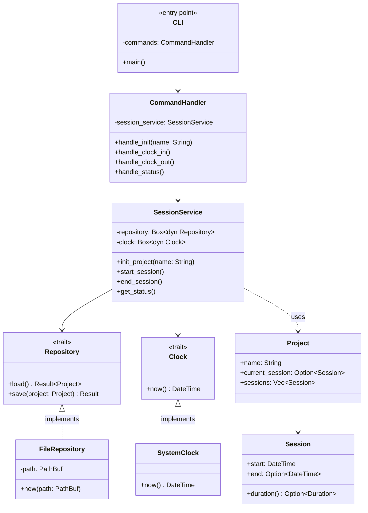

# Dependencies

- clap for arguments
- serde for JSON
- chrono for time

## Commands

- clock-me init
  creates a .clockme directory with a data.json file.
  asks for a project name.

- clock-me now
  Record current timestamp.
  Error if already clocked in.

- clock-me out
  Record current ending timestamp.

- clock-me status
  Shows current project, and if you're clocked in or not.

## Data structure

```json
{
  "project_name": "my-app",
  "current_session": {
    "start": "some-dateTime"
  } or null
  "session_list": [
    {"start": "...", "end": "...", "duration_minutes": 2.5}

  ]
}
```

## Next steps

- Breaks
- Reports
- Tags/TODO notices.
- Formatting?


